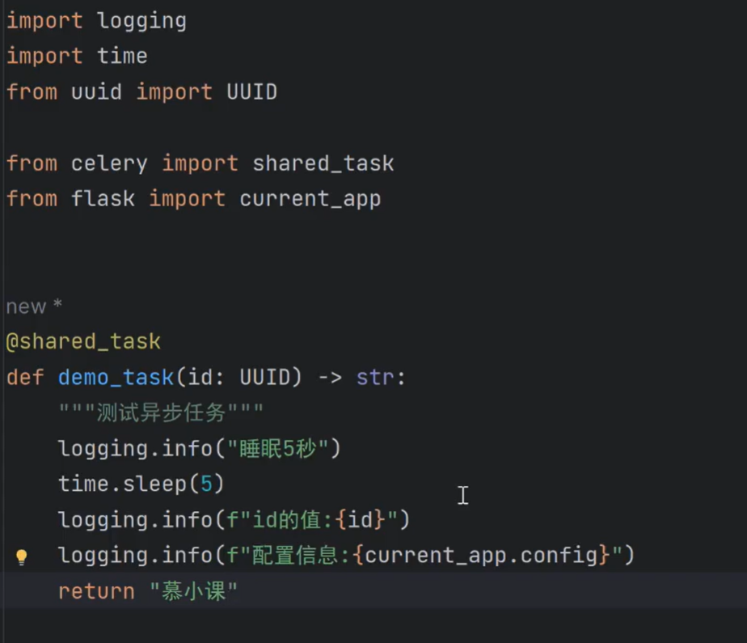

### 1.腾讯云cos对象存储服务接入与API开发

- [x] 1.internal/handler/upload_file_handler.py(class-) + 便捷性导出
- [x] 2.router配置上传文件/上传图片请求路由
- [x] 3.schema/upload_file_schema.py 校验规则
- [x] 4.internal/entity（新建的）定义图片和文件的支持接受的格式
- [x] 5.service/cos_service
- [x] 6.service/upload_file_service 定义一个上传文件服务记录的类

### 2.LLMOps集成日志记录器实现错误记录

- [x] 1.extension/logging_extension [新增]
- [x] 2.server/http [修改：4.初始化falsk扩展->下面加一行代码;_register_error_handler第一行增加错误日志代码]

### 3.Flask集成Redis实现缓存与消息代理

- docker上的redis优点：
    - 安装简洁，可以随意切换不同版本等
- [x] redis配置相关[.env;config/config.py;config/default_config.py]
- [x] extension/redis_extension.py[新建] 自定义redis相关逻辑
- [x] redis依赖注入 [app/http/module.py]
- [x] redis初始化加载 [server/http.py]

```
[//]: # (拉取Redis镜像)
docker pull redis

[//]: # (运行Redis容器)
docker run --name redis-dev -d -p 6379:6379 redis 

[//]: # (在docker上运行redis命令)
docker exec -it redis-dev redis-cli

[//]: # (启动容器)
docker start redis-dev

[//]: # (停止容器)
docker stop redis-dev

[//]: # (控制台安装依赖)
pip install redis

```

### 4.Flask集成Celery处理异步任务

- [x] 1.安装依赖和配置
    - pip install celery eventlet(只有在window才需要安装)
    - .env配置
    - config.py文件配置CELERY
    - default_config Celery相关配置
- [x] 2.extension/celery_extension.py[新建] celery可扩展逻辑代码
- [x] 3.app/http/app.py [修改:从app中提取Celery]
- [x] server/http.py中导入初始化并执行在flask扩展中
- [x] 4.task 异步任务
    - demo_task.py 测试celery异步任务代码
        - 
- [x] 5.handler/app_handler 导入demo_task.py并在ping中测试调用 [12:23]
- [x] 6.执行celery前需要先启动celery服务:
    - 命令: celery -A app.http.app.celery worker --loglevel INFO --pool eventlet --logfile storage/log/celery.log
      便捷性配置 [15:40]
    - redis可视化窗口看效果[14:50]

- 5.知识库三大层级与扩展表ORM模型实现
- [x] internal/model/dataset.py需要创建几个ORM表
    - 创建知识库
    - 文档表
    - 片段表
    - 关键词表
    - 知识库查询表
    - 文档处理规则表
    - 应用知识库关联表模型
- [x] 便捷性导出
- [x] 运行 [db migrate] 再更新 [db upgrade]

### 5.知识库增删改查4个API接口的设计与实现

- [x] handler/dataset_handler [新增]
    - [x] 实现DatasetHandler
        - create_dataset 创建知识库
        - get_dataset 根据知识库ID获取详情
        - upload_dataset 更新知识库
    - [x] 便捷性导出
- [x] router 中新增知识库模板相关路由配置
- [x] schema/dataset_schema [新增] 校验规则
    - [x] CreateDatasetReq 创建知识库请求
    - [x] GetDatasetResp 获取知识库详情响应结构
    - [x] UpdateDatasetReq 更新知识库
    - [x] GetDatasetsWithPageReq 获取知识库分页列表请求数据
    - [x] GetDatasetsWithPageResp 获取知识库分页列表响应数据
- [x] service/dataset_service [新增] 知识库服务处理逻辑
    - [x] 实现DatasetService类
        - 注入SQLAlchema
        - 实现 create_dataset
        - 实现 get_dataset tudo一个临时 account_id
        - 实现 upload_dataset
        - 实现 get_dataset_with_page tudo一个临时 account_id
- [x] entity/dataset_entity [新增] 知识库公用规则常量
- [x] model/dataset [修改]
    - Dataset 类中用 @property 装饰一个 document_count 函数
    - Dataset 类中用 @property 装饰一个 hit_count 函数
    - Dataset 类中用 @property 装饰一个 character_count 函数
    - Dataset 类中用 @property 装饰一个 related_app_count 函数

### weaviate向量数据库的配置与安装

- [huggingface本地模块](https://huggingface.co/Alibaba-NLP/gte-multilingual-base)

```plaintext

# docker启动
docker run -p 8080:8080 -p 50051:50051 cr.weaviate.io/semitechnologies/weaviate:1.38.3

docker run --name weaviate-dev -d -p 8080:8080 -p 50051:50051 semitechnologies/weaviate:latest

docker stop weaviate-dev 停止
docker start weaviate-dev 启动
```

### jieba分词服务设计

- [x] /service/jieba_service.py [新建]
- [x] /entity/jieba_entity.py [新建]
- [x] /handler/dataset_handler 测试jieba服务
- 下载依赖：pip install jieba

### 通用文件加载器实现cos文件加载

- core/file_extractor 新增文档加载处理

### 新增文档API接口同步设计与实现

- [x] handler/document_handler.py
    - 实现 dodumentHandler 类
        - 实现 create_documents 方法
- [x] schema/document_schema
    - 实现 CreateDocumentsReq 类
        - 属性：upload_file_ids
        - 属性:process_type
    - 实现 CreateDocumentsResp 类
- [x] entity/dataset_entity
    - 定义文档处理规则类型枚举
- [x] schema/schema 修改 DictField
    - data/process_formdata/_value修改
- [x] service/document_service 新增
    - 实现 DocumentService
        - create_documents 创建文档方法
            - [第六点异步任务后面实现]

### 知识库文档分段规则校验逻辑实现

- [ ] 路由：/datasets:/dataset_id/documents POST 的实现

### 加载与分割文档异步任务设计与实现

- [x] 创建异步任务：task/document_task.py [新建]
    - 定义方法 build_documents
- [x] service/indexing_service [新建]
    - 实现 IndexingServece 类
        - build_documents
            - 6-7 下一节完成
        - _parsing
        - _clean_extra_text
        - _splitting
- [x] service/document_service [修改]
    - 导入document_tesk异步任务
        - 写入：build_documents.delay([document.id for document in documents])
- [x] entity/dataset_entity 增加 DocumentStatus/SegmentStatus 枚举类
- [x] model/dataset 修改：创建只读属性【upload_file/process_rule】
- [x] service/process_rule_service [新增处理规则服务]
    - 实现 ProcessRuleRervice 类
        - 实现类方法 get_text_splitter_by_process_rule
        - 实现类方法 clean_text_by_process_rule
- [x] lib/helper 修改，新增一个generate_text_hash 根据文本计算对应的哈希值

### 文档索引与存储异步任务设计与实现

- [x] service/indexing_service 修改
    - 完善 service/indexing_service -> build_documents 6-7步骤
    - 实现_indexing 方法
    - 实现_complated 方法
- [x] service/keyword_table_service [新增]
    - 实现 KeywordTableService 知识库关键词服务类
        - 实现 get_keyword_table_dataset_id 方法